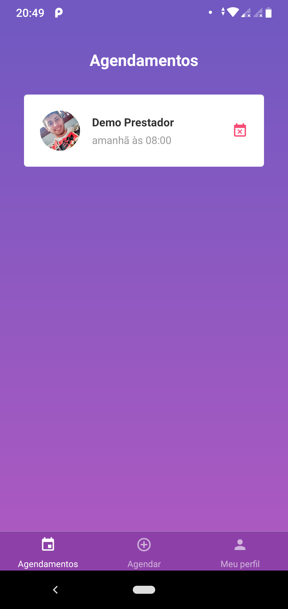
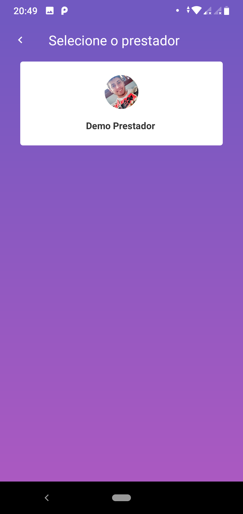
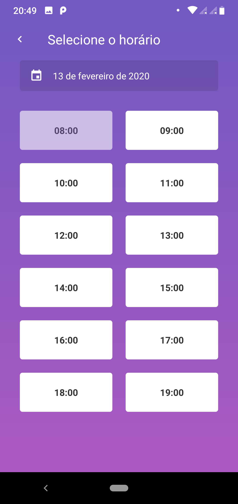

<h1 align="center">
    
</h1>

<h3 align="center">
  GoBarber mobile - Aplicação desenvolvida durante o curso de React Native.
</h3>

<h3 align="center">
  #rocketseat, #reactNative, #reduxSagas, #styledcomponents, #axios, #datefns, #android, #ios
</h3>

  <a href="#rocket-sobre-a-aplicação">Sobre a Aplicação</a>&nbsp;&nbsp;&nbsp;|&nbsp;&nbsp;&nbsp;
  <a href="#páginas-da-aplicação">Páginas da Aplicação</a>&nbsp;&nbsp;&nbsp;|&nbsp;&nbsp;&nbsp;

## :rocket: Sobre a Aplicação

O software desenvolvido é o aplicativo mobile do **GoBarber**, uma aplicação de agendamentos de serviços de beleza.

Abaixo segue todo o conteúdo que foi abordado no curso para o desenvolvimento da aplicação.

## GoBarber mobile
- Estrutura configurada
- Configurando Root Import
- Rotas de autenticação
- Configurando background
- Input & Button
- Página SignIn
- Página SignUp
- Configurando StatusBar
- Dicas de acessibilidade
- Reactotron
- Configurando Redux
- Conectando Redux
- Rota inicial
- Estilizações das rotas
- Lista de agendamentos
- Agendamentos da API
- Atualização de perfil
- Logout
- Rotas de agendamento
- Listagem de prestadores
- DatePicker por plataforma
- Selecionando horário
- Confirmando agendamento
- Load de agendamentos

## Páginas da Aplicação

### Dashboard

### Agendamentos

### Perfil

